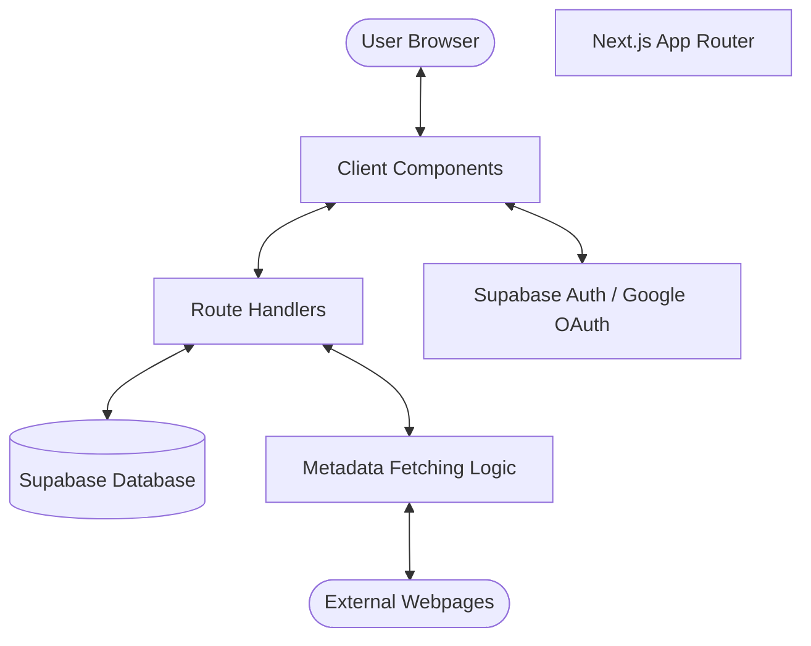
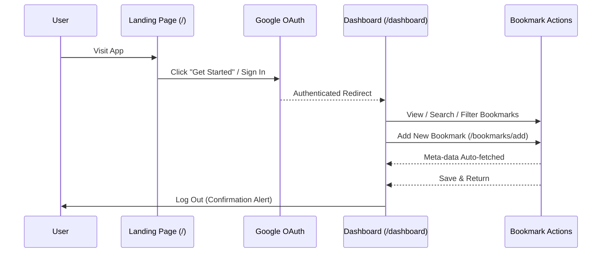

# Bookmark Manager

A production-ready bookmark manager built with **Next.js (App Router)**, **Supabase Auth (Google OAuth)**, and **Supabase Database**.

## Demonstration


https://github.com/user-attachments/assets/6766c081-4c43-4fa4-b1a1-331c8f437d82


## 🚀 Features

- **Google OAuth**: Secure sign-in using Google.
- **RESTful API**: Clean Next.js Route Handlers for all operations.
- **Automatic Metadata Fetching**: Automatically fetches webpage titles and descriptions from URLs.
- **Dark & Light Mode**: Persistent theme toggler across the entire app.
- **Tag Management**: Add, filter, and organize bookmarks using custom tags.
- **Real-time Search**: Search through your collection by title or URL instantly.
- **Route Protection**: Protected dashboard and bookmark management paths via middleware.

---

## 🏗️ System Architecture



---

## 🔄 User Flow



---

## 🛠️ Setup Instructions

### 1. Prerequisites
- Node.js installed.
- A [Supabase](https://supabase.com/) account and project.
- A [Google Cloud Console](https://console.cloud.google.com/) project for OAuth.

### 2. Environment Variables
Create a `.env.local` file in the root directory:
```env
NEXT_PUBLIC_SUPABASE_URL=your_project_url
NEXT_PUBLIC_SUPABASE_ANON_KEY=your_anon_key
```

### 3. Database Initialization
Run the following SQL in your Supabase SQL Editor:
```sql
create table bookmarks (
  id uuid default gen_random_uuid() primary key,
  user_id uuid references auth.users not null,
  url text not null,
  title text not null check (char_length(title) <= 200),
  description text check (char_length(description) <= 500),
  tags text[] default array[]::text[],
  created_at timestamp with time zone default timezone('utc'::text, now()) not null
);

-- Enable Row Level Security
alter table bookmarks enable row level security;

-- Create policy for user isolation
create policy "Users can manage their own bookmarks"
  on bookmarks for all
  using (auth.uid() = user_id);
```

### 4. Installation & Startup
```bash
npm install
npm run dev
```
Visit `http://localhost:3000`.

---

## 🎨 Design Decisions

- **Separation of Concerns**: UI, business logic (validation), and API communication are clearly separated.
- **Shared Validation**: `lib/validator.js` is used on both the client (for instant feedback) and the server (for security).
- **Theme Variables**: Vanilla CSS with CSS Variables (`globals.css`) ensures smooth transitions between light and dark modes without layout shifts.
- **Stateless API**: Next.js Route Handlers act as a thin REST API layer between the frontend and Supabase.
- **Middleware-based Protection**: Uses a single `middleware.js` to handle both public access (`/`) and protected session management (`/dashboard`).
- **Optimization**: Metadata fetching is debounced (800ms) to prevent excessive API calls while the user is typing a URL.

---

## 📂 Project Structure

- `app/`: Next.js App Router structure.
- `components/`: UI components (Form, List, Item, Toggle).
- `lib/`: Shared utilities (Supabase clients, Validation logic).
- `api/`: REST endpoints for bookmarks and metadata.
- `middleware.js`: Auth & route protection logic.
